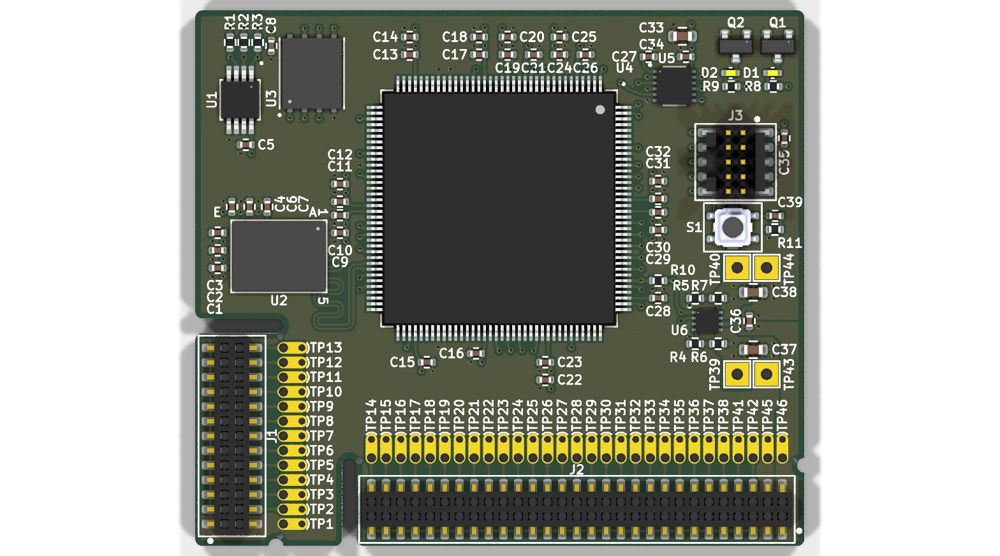
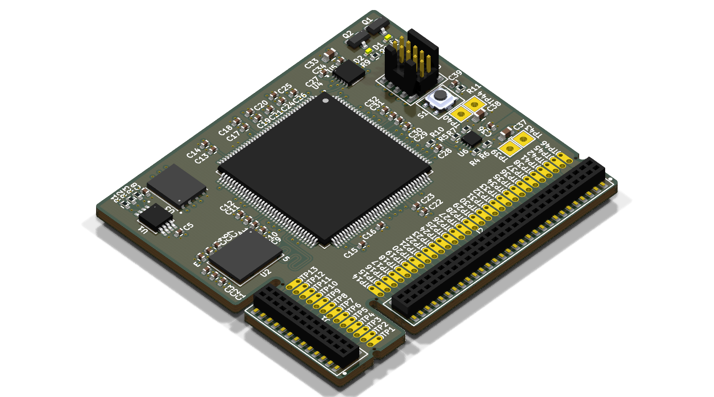
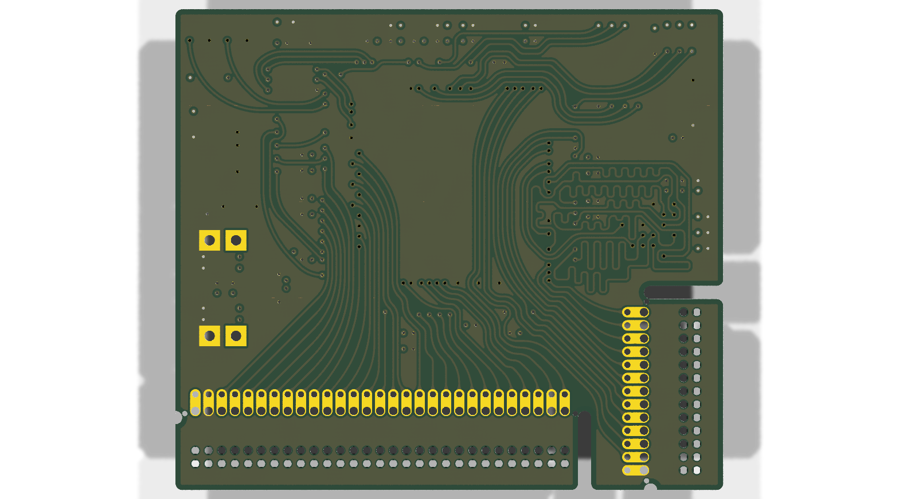

# Minimal_MAX32650

## Overview

This repository contains a minimal KiCad design project for the Analog Devices MAX32650, an ultra-low-power microcontroller unit (MCU) designed for high-performance, battery-powered applications. It is part of the DARWIN family of MCUs, which are built to handle complex applications in the evolving Internet of Things (IoT) landscape.

## Disclaimer

> [!NOTE]
> This project is provided "as is" and without any warranty, express or implied. For more details, please see the [LICENSE](LICENSE) file.

## About the MAX32650

The MAX32650 from Analog Devices is an ultra-low-power microcontroller unit (MCU) designed for high-performance, battery-powered applications. It is part of the DARWIN family of MCUs, which are built to handle complex applications in the evolving Internet of Things (IoT) landscape.

Key features include:

- **Processor:** It uses an Arm® Cortex®-M4 processor with a Floating Point Unit (FPU) that can run at a core speed of 120MHz.
- **Memory:** The MCU is equipped with 3MB of internal Flash memory and 1MB of internal SRAM. It also supports memory scalability through multiple memory-expansion interfaces.
- **Power Consumption:** It is designed for low power consumption, with a rating of 104µW/MHz when executing from cache at 1.1V. It features five low-power modes to control the clock, peripherals, and voltage.
- **Peripherals and Interfaces:** The MAX32650 includes a variety of interfaces, such as a USB 2.0 Full-Speed Device Interface, a Micro-SD Card Interface, and up to 105 General-Purpose I/O (GPIO) pins. It also has a SmartDMA feature that performs complex background processing to reduce overall power consumption.
- **Secure Versions:** A secure version, the MAX32651, is available with a trust protection unit (TPU) that provides features like an AES engine, a secure bootloader, and on-the-fly data decryption.

## Project Structure

```
minimal_max32650/
├── minimal_max32650.kicad_sch       # Main schematic file
├── minimal_max32650.kicad_pcb       # PCB layout file
├── minimal_max32650.kicad_pro       # Project configuration file
├── fp-lib-table                     # Footprint library table
├── sym-lib-table                    # Symbol library table
├── project_jobs_set.kicad_jobset    # Project job settings
├── ibom.config.ini                  # Interactive BOM configuration
├── docs/                            # Documentation files
│   ├── pictures/                    # Images and photos
│   ├── schematics/                  # Schematic PDF exports
│   └── 3d_models/                   # 3D model files
└── KiCAD_Symbols_Generator/         # Submodule for symbol generation from CSV data
```

## Project Features

This design provides a minimal implementation of the MAX32650 with the following features:

- **Power Supply:**
  - VIN: +3.3V
- **Bill of Materials (BOM):**
  - Interactive HTML BOM (`ibom.html`) for easy component identification and sourcing.
- **Libraries:**
  - Comprehensive symbol and footprint libraries integrated as a submodule.
- **3D Model:**
  - Includes a 3D model of the board for better visualization.

## Getting Started

### Prerequisites

- [KiCad EDA](https://www.kicad.org/) version 9.0 or later installed on your system
- Git (for cloning the repository and submodule management)

### Opening the Project

1. **Clone the repository** (including submodules):
   ```bash
   git clone --recursive https://github.com/ionutms/Minimal_MAX32650.git
   ```
   
   If you've already cloned the repository without submodules, initialize them with:
   ```bash
   git submodule init
   git submodule update
   ```

2. **Open the project in KiCad**:
   - Launch KiCad
   - Click "Open Existing Project"
   - Navigate to the cloned repository folder
   - Select the `minimal_max32650.kicad_pro` file

3. **Explore the design**:
   - Open the schematic editor to view the circuit design
   - Open the PCB editor to view the board layout
   - Review the symbol and footprint libraries used in the design

### Project Files

- **Main schematic**: `minimal_max32650.kicad_sch` - Contains the primary circuit design with the MAX32650 and support components
- **PCB layout**: `minimal_max32650.kicad_pcb` - Physical board design file with proper component placement
- **Project configuration**: `minimal_max32650.kicad_pro` - KiCad project settings

## Dependencies

This project has the following dependencies:

### 1. KiCAD Symbols Generator

This repository uses [KiCAD_Symbols_Generator](https://github.com/ionutms/KiCAD_Symbols_Generator) as a submodule for custom symbol generation.

To initialize the submodule after cloning this repository:

```bash
git submodule update --init --recursive
```

### 2. 3D Models

This project requires the [3D_Models_Vault](https://github.com/ionutms/3D_Models_Vault) repository for 3D models.

#### Setup for KiCAD 9:

1. Clone the 3D models repository:
   ```bash
   git clone https://github.com/ionutms/3D_Models_Vault.git
   ```

2. In KiCAD 9, add an environment variable:
   - Variable name: `KICAD9_3D_MODELS_VAULT`
   - Variable value: Full path to where you cloned the 3D_Models_Vault repository

## Usage

After setting up the dependencies, open the project in KiCAD 9 to access all features including the 3D models.

## Symbol Generator Submodule

This project includes the KiCAD_Symbols_Generator as a submodule, which provides tools for generating KiCad symbols from CSV data files. For more information on using this tool, see the [KiCAD_Symbols_Generator documentation](minimal_max32650/KiCAD_Symbols_Generator/README.md).

## Documentation

The `docs` folder contains:
- Schematic PDF exports
- Images and photos of the design
- 3D model files (GLB and WRL formats)

## Visuals

The following images showcase the PCB design from different perspectives:


*Top View of the PCB*


*Side View of the PCB*


*Bottom View of the PCB*

## License

This project is licensed under the MIT License - see the [LICENSE](LICENSE) file for details.

## References

- [MAX32650 Datasheet](https://www.analog.com/media/en/technical-documentation/data-sheets/MAX32650-MAX32651.pdf)
- [KiCad EDA](https://www.kicad.org/)